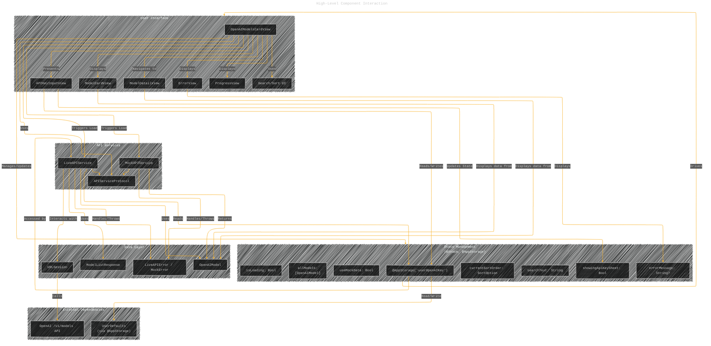

# Alchemy Models - A Diagrammatic Guide
> **Disclaimer:**
>
> This document contains my personal notes on the topic,
> compiled from publicly available documentation and various cited sources.
> The materials are intended for educational purposes, personal study, and reference.
> The content is dual-licensed:
> 1. **MIT License:** Applies to all code implementations (Swift, Mermaid, and other programming languages).
> 2. **Creative Commons Attribution 4.0 International License (CC BY 4.0):** Applies to all non-code content, including text, explanations, diagrams, and illustrations.
---

Here's a documentation focusing on concepts and complexities, illustrated with Mermaid diagrams:

**Code Summary:**

*   **`OpenAIModelsCardView`:** The main SwiftUI view, managing state (models, loading, errors, sorting, search, API key sheet), fetching data via an `APIServiceProtocol`, and displaying the list or error/loading states. It uses `NavigationStack` for navigation to `ModelDetailView`.
*   **`APIServiceProtocol`:** Defines the contract for fetching models, allowing for mock (`MockAPIService`) and live (`LiveAPIService`) implementations.
*   **`MockAPIService`:** Provides hardcoded sample `OpenAIModel` data, simulating network delay.
*   **`LiveAPIService`:** Fetches models from the actual OpenAI `/v1/models` endpoint using `URLSession` and `async/await`. It retrieves the API key from `@AppStorage`. Handles various API errors (`LiveAPIError`).
*   **`APIKeyInputView`:** A sheet view allowing users to enter and save their OpenAI API key to `@AppStorage`.
*   **`OpenAIModel`:** The `Codable`, `Identifiable`, and `Hashable` data structure representing an OpenAI model. It uses `CodingKeys` for custom JSON mapping (`owned_by`) and includes default values for properties not present in the basic `/v1/models` response (`description`, `capabilities`, etc.), ensuring consistency with the mock data structure. An extension provides UI-related computed properties (`profileSymbolName`, `profileBackgroundColor`).
*   **Helper Views:** `ModelCardView` (row item), `ModelDetailView`, `ErrorView`, `WrappingHStack` (for tags/capabilities).
*   **Enums:** `SortOption`, `LiveAPIError`, `MockError`.

**Key Complexities & Concepts Illustrated:**

1.  **Component Interaction & Dependency:** How the main view orchestrates interactions between UI, state, data services, and the API key input mechanism.
2.  **State Management & UI Updates:** The flow of state changes (`isLoading`, `errorMessage`, `allModels`, `useMockData`, `showingApiKeySheet`) and how they drive UI updates.
3.  **Conditional API Service:** The dynamic switching between `MockAPIService` and `LiveAPIService` based on the `useMockData` toggle.
4.  **API Key Handling Logic:** The intricate process of checking for the API key, prompting the user if needed, saving the key, and then triggering the API call.
5.  **Data Loading & Error Propagation:** The `async/await` flow for fetching data, including error catching and updating the UI state accordingly.
6.  **Data Model Flexibility:** How `OpenAIModel` handles data from both mock sources (with extra details) and the live API (with fewer details) using default values and `CodingKeys`.

---

## Mermaid Diagrams:

### 1. High-Level Component Interaction

This diagram shows the main components and their primary relationships.

**Explanation:** This diagram illustrates the dependencies between the UI views, state management variables, API services (following the `APIServiceProtocol`), data models/errors, and external systems like the OpenAI API and `UserDefaults`. It highlights how the `OpenAIModelsCardView` acts as the central coordinator.

---

### 2. Data Loading Flow (Happy Path & Mock/Live Switch)

This diagram shows the sequence of events when loading data, triggered by the user or view appearance, including the logic for choosing the API service.

**Explanation:** This flowchart details the logic within `attemptLoadModels`, `loadModelsAsyncWithLoadingState`, and `loadModelsAsync`. It shows the checks for `isLoading`, `useMockData`, and the API key's presence (`@AppStorage`). It explicitly shows the path to presenting the `APIKeyInputView` sheet if the live API is selected but the key is missing. The `@MainActor` annotation implies UI updates happen on the main thread after the async fetch completes.

---

### 3. API Key Handling and Live API Trigger Logic

This diagram focuses specifically on the complex interaction triggered by the `Toggle` and the `APIKeyInputView`.

**Explanation:** This flowchart details the steps initiated when the `useMockData` toggle changes, particularly when switching *to* the Live API. It shows the check for the stored key, the presentation of the `APIKeyInputView`, the actions within that view (Save/Cancel), and the subsequent triggering of the live data load or reverting the toggle if canceled.

---

### 4. State Management Cycle in `OpenAIModelsCardView`

This diagram illustrates the primary states of the main view and the transitions between them.

**Explanation:** This state diagram shows the lifecycle of the `OpenAIModelsCardView`. It starts `Idle`, moves to `Loading` when data fetch begins, then transitions to either `DisplayingData` or `DisplayingError`. It also shows the `PromptingForKey` state, entered when the live API is needed but the key is missing, and how it transitions back based on user action in the sheet. Actions like filtering/sorting happen within the `DisplayingData` state.

---

### 5. `LiveAPIService` Error Handling Flow

This diagram shows how errors are handled within the `LiveAPIService`.

**Explanation:** This flowchart breaks down the error handling within `LiveAPIService.fetchModels`. It shows the initial API key check, the `try/catch` block around the `URLSession` call (handling network errors and non-2xx status codes, specifically 401), and the nested `try/catch` block for JSON decoding. Each potential failure point maps to a specific `LiveAPIError` case, which is then thrown and eventually caught by the `OpenAIModelsCardView` to update the `errorMessage` state.

---

### 6. `OpenAIModel` Structure & Codable Handling

This diagram illustrates the structure of the data model and how `Codable` interacts with it, especially regarding default values.

**Explanation:** This class diagram shows the properties of the `OpenAIModel`. Critically, it highlights which properties are included in the `CodingKeys` enum (and thus actively mapped during JSON decoding) and which are not. Because `description`, `capabilities`, `contextWindow`, and `typicalUseCases` are *not* in `CodingKeys`, Swift's `Codable` synthesis ignores them when decoding JSON from the `/v1/models` endpoint. If the JSON doesn't provide these keys, the properties retain their default initialized values. This design allows the struct to be used consistently with both the detailed mock data and the less detailed live API data. The diagram also shows the simple `ModelListResponse` wrapper used for decoding the overall API response.

---
**Licenses:**

- **MIT License:**   - Full text in [LICENSE](LICENSE) file.
- **Creative Commons Attribution 4.0 International:**  - Legal details in [LICENSE-CC-BY](LICENSE-CC-BY) and at [Creative Commons official site](http://creativecommons.org/licenses/by/4.0/).

---